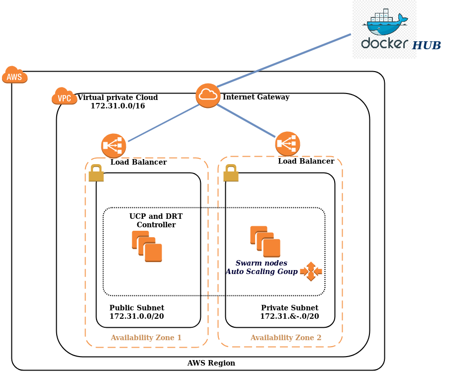

# terraform-docker-swarm
Este projeto contem codigos docker-swarm no aws

#### Stack deploy usando o compose
<pre>
docker stack deploy -c docker-compose.yml nginx
</pre>

#### Escalar o serviço
<pre>
docker service scale nginx_web-nginx=3
</pre>

### Arquitetura no AWS
